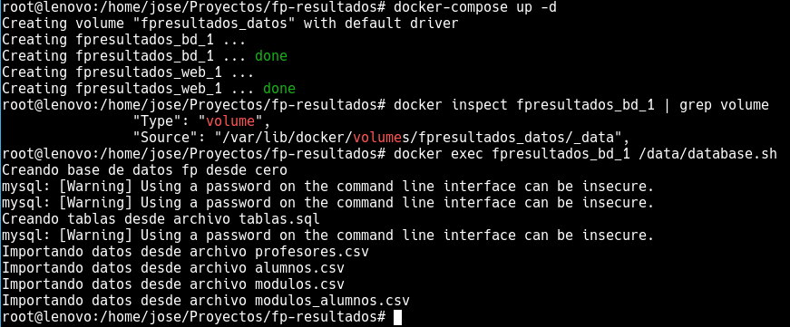
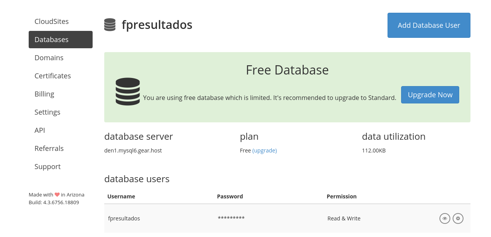
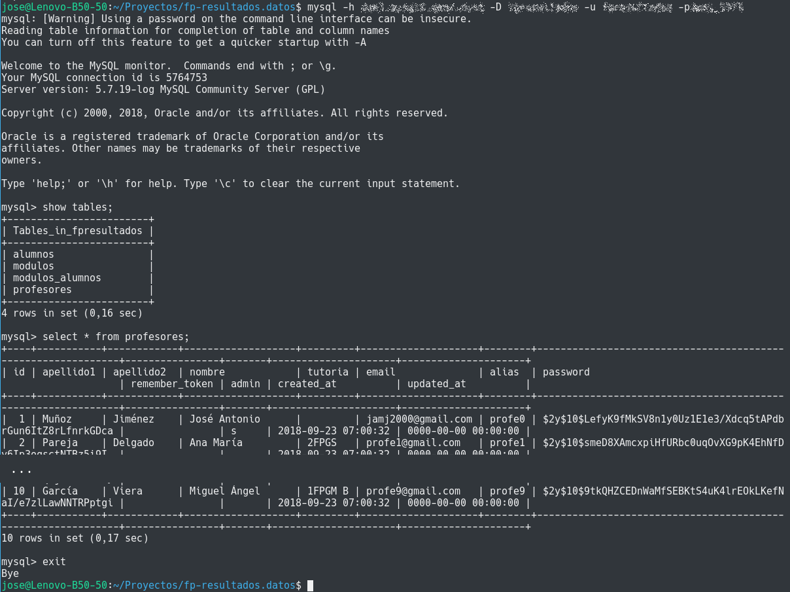
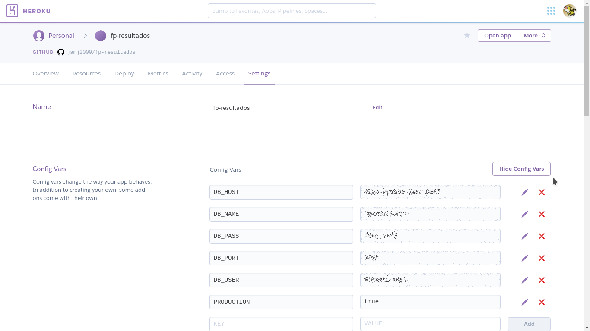
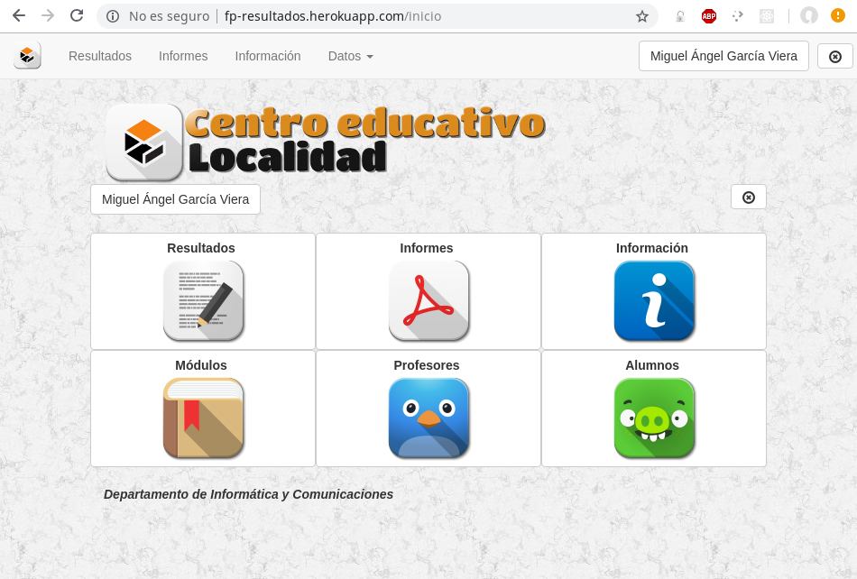

# fp-resultados


## Repositorios relacionados
- [App para android](https://github.com/jamj2000/fp-resultados.apk)
- [Datos de ejemplo](https://github.com/jamj2000/fp-resultados.datos)
- [Capturas](https://github.com/jamj2000/fp-resultados.capturas)


## Introducción
__fp-resultados__ es una aplicación web destinada al profesorado de Formación Profesional en España. Realizada en mi tiempo libre para seguir aprendiendo sobre distintas tecnologías web. La pongo a disposición de toda la comunidad por si alguien la considera interesante por motivos didácticos o de producción.


Existe una aplicación funcional alojada en [heroku.com](http://fp-resultados.herokuapp.com) para fines demostrativos. La primera vez que se accede a ella suele tardar algún tiempo en cargar. Si esto ocurre volver a intentar de nuevo. 


La aplicación es funcional y dispone de numerosas características.


### Características
- Permite calificar por resultados de aprendizaje.
- Genera actas de evaluación y boletines de calificaciones en HTML y PDF.
- Se ha diseñado pensando en los ciclos formativos de la familia profesional de Informática y Comunicaciones, sin embargo es posible adaptarla a otras familias profesionales.
- Permite las operaciones CRUD (Create, Read, Update, Delete) a base de datos MySQL a través de interfaz web.


### Probar la aplicación de demostración
Si deseas comprobar las funcionalidades que ofrece esta aplicación, abre en el navegador la dirección [http://fp-resultados.herokuapp.com](http://fp-resultados.herokuapp.com).

Para entrar debes introducir un correo y contraseña.
Puedes utilizar cualquiera de los siguientes (correos ficticios):

```
email                  contraseña  
=================================
profe1@gmail.com       profe1
profe2@gmail.com       profe2
profe3@gmail.com       profe3
profe4@gmail.com       profe4
profe5@gmail.com       profe5
profe6@gmail.com       profe6
profe7@gmail.com       profe7
profe8@gmail.com       profe8
profe9@gmail.com       profe9
```
Cada proferor puede calificar los resultados de aprendizaje de los módulos que imparte.
Algunos de ellos son tutores de algún curso, otros no. Los que son tutores pueden ver y generar los boletines de notas de su tutoría. Existe un administrador (yo, con correo real jamj2000@gmail.com) que puede ver y generar las actas de evaluación así como realizar diversas tareas administrativas.

Si deseas comprobar las posibilidades para el/los usuarios administradores deberás instalarte la aplicación en tu equipo local y probarla ahí.


## Despliegue en equipo local

Este proyecto se desarrolló durante el año 2015, por lo tanto tiene ya algunos años. Es un proyecto realizado en **PHP** con el **Framework Laravel 4.2**. Debido a esto es requisito usar la versión **PHP5** en lugar de la versión PHP 7 actual. La mayoría de las distribuciones modernas ya vienen con PHP 7. Así que si deseamos instalar la versión 5 deberemos añadir los repositorios adecuados. 

Si estás interesado en probar la aplicación en tu equipo local, aquí tienes los pasos a seguir para PC con distro Ubuntu o similar:

0) Prerrequisito de PHP 5.

Para instalar la versión 5 de PHP, debemos añadir los repositorios adecuados. Por ejemplo, para Ubuntu 18.04 hacemos:

```bash
sudo add-apt-repository -y ppa:ondrej/php
sudo apt update
```

1) Instala los paquetes necesarios para tener un servidor Apache+PHP+MySQL

```bash
sudo apt-get install apache2 mysql-server php5.6 php5.6-mysql php5.6-mcrypt mcrypt curl git
```

**NOTA:** De aquí en adelante, por simplicidad, no repetiré en cada comando la orden `sudo`. Sin embargo **todas los pasos y operaciones realizadas a continuación deben realizarse con perfil de superusuario**. 


2) Configura el archivo /etc/apache2/apache2.conf, para que aparezca

```apache
<Directory /var/www/>
  Options Indexes FollowSymLinks
  AllowOverride All
  Require all granted
</Directory>
```
 
3) Activa módulos de Apache y reinicia servidor

```bash
a2enmod rewrite
phpenmod mcrypt
systemctl restart apache2
``` 
 
4) Descarga código del repositorio [fp-resultados](https://github.com/jamj2000/fp-resultados)

```bash
cd /var/www/html
git clone https://github.com/jamj2000/fp-resultados.git
```

5) Entra en el directorio donde se ha descargado el código y da permisos de escritura al subdirectorio app/storage

```bash
cd /var/www/html/fp-resultados
chmod -R 777 app/storage
```

6) Instala el software `composer`.

```bash
curl -sS  https://getcomposer.org/installer | php
mv composer.phar /usr/local/bin/composer
```

7) Instala las dependencias necesarias 

```bash
cd /var/www/html/fp-resultados
composer install
```

Esto nos permite comprobar las dependencias especificadas en el archivo `composer.json` e instalar los paquetes enumerados en ese archivo, recreando el entorno que se estaba utilizando por última vez.

Si todo ha ido bien, se creará una carpeta llamada `vendor` con todos los paquetes que necesita la aplicación como dependencias.

8) Prueba en el navegador [http://localhost/fp-resultados/public](http://localhost/fp-resultados/public)

9) Descarga datos de ejemplo del repositorio [fp-resultados.datos](https://github.com/jamj2000/fp-resultados.datos)

```bash
cd /var/www/html
git clone https://github.com/jamj2000/fp-resultados.datos.git
```

10) Revisa el script ```database.sh``` para modificar tu usuario y clave de mysql

```bash
cd /var/www/html/fp-resultados.datos
nano database.sh
```
11) Ejecuta el script ```database.sh```

```bash
chmod +x database.sh
./database.sh
```

12) Recuerda que los valores previos también deben hallarse en el archivo ```/var/www/html/fp-resultados/app/config/local/database.php```. Por ejemplo para usuario root y clave root. Modifica los valores según hayas hecho en ```database.sh```.

```php
               'mysql' => array(
                        'driver'    => 'mysql',
                        'host'      => 'localhost',
                        'port'      => '3306',
                        'database'  => 'fp',
                        'username'  => 'root',
                        'password'  => 'root',
                        'charset'   => 'utf8',
                        'charset'   => 'utf8',
                        'collation' => 'utf8_unicode_ci',
                        'prefix'    => '',
                ),

```

13) Si necesitas establecer o cambiar una clave en MySQL, puedes hacerlo con el comando de mysql:

**`ALTER USER '`usuario`'@'localhost' IDENTIFIED WITH mysql_native_password BY '`clave`';`**

En las últimas versiones el sistema de autenticación ha sido cambiado de forma significativa respecto a versiones anteriores. Si instalas la version 5.7 o superior de mysql, usará el plugin auth_socket y no proporcionará una contraseña al usuario root. Pero nosotros queremos ponerle una contraseña.

**Para ello necesitamos cambiar el plugin y establecer la contraseña al mismo tiempo, en el mismo comando**. Primero, cambiar el plugin y luego configurar la contraseña no funcionará, y volverá a caer en auth_socket.


Por ejemplo para el usuario root hacemos:
```
sudo mysql -u root

mysql> ALTER USER 'root'@'localhost' IDENTIFIED WITH mysql_native_password BY 'root';
mysql> FLUSH PRIVILEGES;

mysql> SELECT User, Host, plugin FROM mysql.user;
+------------------+-----------+-----------------------+
| User             | Host      | plugin                |
+------------------+-----------+-----------------------+
| root             | localhost | mysql_native_password |
| mysql.session    | localhost | mysql_native_password |
| mysql.sys        | localhost | mysql_native_password |
| debian-sys-maint | localhost | mysql_native_password |
| jose             | localhost | auth_socket           |
+------------------+-----------+-----------------------+
5 rows in set (0.00 sec)

mysql> SELECT User, Host, authentication_string FROM mysql.user;
+------------------+-----------+-------------------------------------------+
| User             | Host      | authentication_string                     |
+------------------+-----------+-------------------------------------------+
| root             | localhost | *81F5E21E35407D884A6CD4A731AEBFB6AF209E1B |
| mysql.session    | localhost | *THISISNOTAVALIDPASSWORDTHATCANBEUSEDHERE |
| mysql.sys        | localhost | *THISISNOTAVALIDPASSWORDTHATCANBEUSEDHERE |
| debian-sys-maint | localhost | *B117D4112EFD856563A869CC76ABE86FCA0735C2 |
| jose             | localhost | *9B7E9CB5C7418FF658BE5C710AC2A3688DFAABF8 |
+------------------+-----------+-------------------------------------------+
5 rows in set (0.00 sec)

mysql> exit;

systemctl restart mysql
```

Si el usuario no existe, utilizar `CREATE` en lugar de `ALTER`.

> REFERENCIA: He dado con la solución al problema anterior en el siguiente enlace, después de haber visitado media internet:
>
> - https://www.percona.com/blog/2016/03/16/change-user-password-in-mysql-5-7-with-plugin-auth_socket/


> NOTA: En algunos casos está habilitada una **política de contraseñas** bastante estricta, del tipo: introducir al menos 8 caracteres, minúsculas y mayúsculas, dígitos y caracteres no alfanuméricos. Podemos deshabilitarla con:
>
>```
>mysql> uninstall plugin validate_password;
>```


## Despliegue en Docker

También puedes desplegar la aplicación con Docker. Existe una imagen para la aplicación web y otra para la base de datos.

Para descargar las imágenes y lanzar los contenedores, ejecuta:


```
git  clone  https://github.com/jamj2000/fp-resultados.git

cd fp-resultados.git

docker-compose  up  -d
```

Para insertar los datos en el volumen asociado a MySQL ejecuta:

```
docker  exec  fpresultados_bd_1  /data/database.sh
```



Para ejecutar la aplicación, abre con el navegador la URL `http://localhost:8888`.

Como puedes observar en la imagen anterior, el contenedor de MySQL lleva asociado un **volumen** para guardar la información de la BD y ofrecer persistencia de datos entre distintas ejecuciones. 

En cualquier momento podemos realizar una copia de seguridad del volumen con el contenido de la BD, con el comando:

**Exportar volumen fpresultados_datos** 


```bash
docker run --rm \
  -v fpresultados_datos:/source:ro \
  busybox tar -czC /source . > fpresultados_datos.tar.gz
```

Y obtendremos una copia de seguridad del volumen en el archivo `fpresultados_datos.tar.gz`.

Para restaurar la copia de seguridad anterior de dicho volumen ejecutamos el siguiente comando:

**Importar volumen fpresultados_datos**

```bash
docker run --rm -i \
  -v fpresultados_datos:/target \
  busybox tar -xzC /target < fpresultados_datos.tar.gz
```

> NOTA: 
>Antes de restaurar la copia de seguridad deberemos asegurarnos de que la aplicación está detenida y el volumen no existe. Esto puede hacerse con los comandos:
>
> ```bash
> docker-compose  down
> docker  volume  rm  fpresultados_datos
> ```
> Después restauramos el volumen según se indica más arriba y por último iniciamos la aplicación con `docker-compose up -d`.


## Despliegue en Heroku + GearHost

Actualmente la aplicación está desplegada en [HEROKU](https://www.heroku.com). Como base de datos utiliza DBaaS MySQL proporcionado por [GEARHOST](https://gearhost.com).

Si deseas hacer un despligue usando los servicios proporcionados por los sitios anteriores, sigue estos pasos: 

1. Create una cuenta en Heroku. Éste tiene varios [planes](https://www.heroku.com/pricing). Registrate en el plan Free, que aunque está algo limitado es gratis.

2. Instala la herramienta `heroku-cli`. En [este enlace](https://devcenter.heroku.com/articles/heroku-cli) tienes la información necesaria.

3. Clona este repositorio en tu equipo:
  ```bash
  git  clone  https://github.com/jamj2000/fp-resultados.git
  cd   fp-resultados
  ```

4. Inicia sesión desde el terminal en la cuenta que previamente creaste en Heroku. Y crea una nueva aplicación. 
  
  ```bash
  heroku login  --interactive
  heroku create --region eu  nombre_aplicacion
  ```
  
  Añadimos el `repositorio git` que proporciona Heroku.
  ```bash
  git  remote  add  heroku  https://git.heroku.com/nombre_aplicacion.git
  ```
  
  **NOTA:** Debes sustituir `nombre_aplicacion` por el nombre que desees dar a tu aplicación. Ten en cuenta que no puede tener espacios en blanco ni tildes. Probablemente tengas que probar con varios nombres, pues muchos de ellos ya están ocupados. La opción `--region eu` es para que la aplicación se aloje en servidores de Europa. 
  
5. Despliega el código en Heroku.

  ```bash
  heroku  push  heroku  master
  ```
  o
  
  ```bash
  git  push  heroku  master
  ```

  Dentro de unos instantes podrás acceder a la aplicación en la url `http://nombre_aplicacion.herokuapp.com`. 
  
  **NOTA:** Debes sustituir `nombre_aplicacion` por el nombre de tu aplicación.
  
  Puedes verla abriendo dicha url en el navegador o ejecutando
  
  ```bash
  heroku  open
  ```
  
6. ¿Y los datos?
  
  Los datos de la aplicación se guardan en una base de datos. En este caso hemos usado el DBaaS que nos proporciona [GearHost](https://www.gearhost.com). Este sitio tiene varios [planes](https://www.gearhost.com/pricing). Escoge el plan Free, que aunque está algo limitado es gratis. 

7. Crea una base de datos MySQL y apunta los parámetros de configuración.
  
  En concreto deberás anotar 5 datos:
  - El nombre o IP de host donde se aloja la base de datos.
  - El puerto.
  - El nombre de la base de datos.
  - El nombre del usuario.
  - La contraseña de dicho usuario.
  
  

8. Crea las tablas e introduce los datos en ellas. Para ello sigue estos pasos:

  - Clona el repositorio que contiene los datos y el script `database.sh` a ejecutar.
  ```bash
  git  clone  https://github.com/jamj2000/fp-resultados.datos.git
  cd  fp-resultados.datos
  ```
  - Edita el script `database.sh` con la información de tu base de datos.
  
  
  
  - Ejecuta el script `database.sh`
 
  
  
  - Comprueba que el resultado es correcto.
  
  ```bash
  mysql -h database.host -D database.name -u database.user -pdatabase.password
  ```
  Sustituye _database.host_,  _database.name_,  _database.user_ y _database.password_ por los valores adecuados.
  
  
   

9. Asegúrate que en el archivo ```/var/www/html/fp-resultados/app/config/database.php``` contiene la siguiente configuración:

  ```php
             'mysql' => array(
                        'driver'    => 'mysql',
                        'host'      => getenv('DB_HOST'),
                        'port'      => getenv('DB_PORT'),
                        'database'  => getenv('DB_NAME'),
                        'username'  => getenv('DB_USER'),
                        'password'  => getenv('DB_PASS'),
                        'charset'   => 'utf8',
                        'charset'   => 'utf8',
                        'collation' => 'utf8_unicode_ci',
                        'prefix'    => '',
                ),
  ```

10. Vuelve a la web de Heroku, inicia sesión, selecciona tu aplicación y pincha en el apartado `Settings` y luego en el botón `Reveal Config Vars`. Crea las variables de entorno que se muestran a continuación con los datos que recopilaste en el apartado anterior. Después pulsa en el boton `More` y luego en `Restart all dynos`, en la parte superior derecha de la página.

  
  

11. Abre el navegador web y ve a la URL de la aplicación. En mi caso `http://fp-resultados.herokuapp.com`.

  Debe aparecer lo siguiente:
  

  Si inicias sesión con usuario `profe9@gmail.com` y contraseña `profe9`:  
  
  

## Despliegue en Openshift (Desactualizado)

Si quieres conocer los detalles técnicos acerca de cómo desplegué esta aplicación en OPENSHIFT puedes seguir [este tutorial](https://github.com/jamj2000/fp-resultados/blob/master/INSTALACION.md) explicando los pasos principales. **Actualmente la guía no es correcta, puesto que la plataforma actualizó toda su infraestructura.**


## Desarrollo de la aplicación con Laravel 4.2

Si quieres conocer los detalles técnicos acerca de cómo he creado está aplicación puedes seguir [este tutorial](https://github.com/jamj2000/fp-resultados/blob/master/DESARROLLO.md) explicando los conceptos principales. Te ayudará a entender el código fuente.


# Licencia

* [GPL-3](http://www.gnu.org/licenses/gpl-3.0.html) / <https://github.com/jamj2000/fp-resultados>
* [CC BY-SA 4.0](https://creativecommons.org/licenses/by-sa/4.0/) / <https://github.com/alecive/FlatWoken>

```
- Código            GPL-3         José Antonio Muñoz Jiménez
- Iconos FlatWoken  CC BY-SA 4.0  Alessandro Roncone         
```
